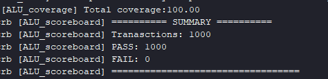
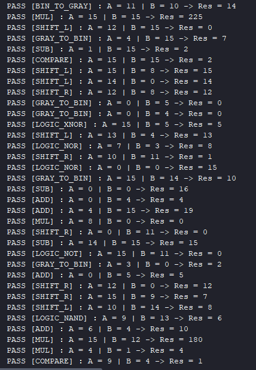
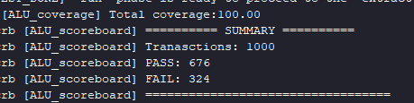
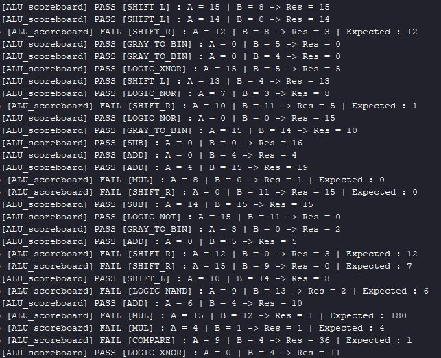
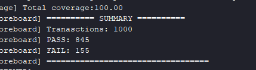
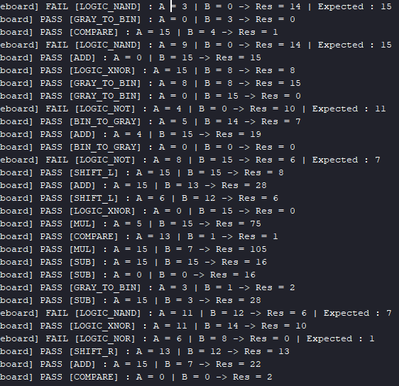
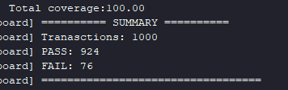
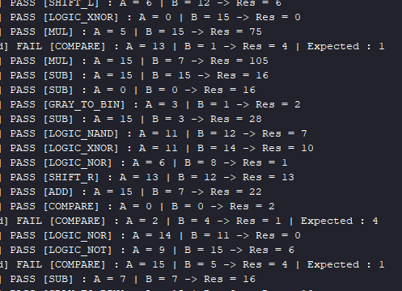

# ALU Verification Environment (UVM Testbench)

This project implements a UVM-based, coverage-driven verification environment for a 4-bit ALU supporting 12 operations (arithmetic, comparison, gray-code conversion, logarithmic shifting, and bitwise logic), following the standard UVM layered architecture (sequence, sequencer, driver, monitor, scoreboard, reference model, functional coverage).

## Design Under Test (DUT)

A combinational ALU with:

- 4-bit operands (`A`, `B`), 4-bit opcode, 8-bit result
- 12 supported operations, selected via a `typedef enum` mirrored on the verification side (`ADD`, `SUB`, `MUL`, `COMPARE`, `BIN_TO_GRAY`, `GRAY_TO_BIN`, `SHIFT_L`, `SHIFT_R`, `LOGIC_NAND`, `LOGIC_NOR`, `LOGIC_XNOR`, `LOGIC_NOT`)
- Built from independently designed and tested sub-modules (adder/subtractor with carry-lookahead, array multiplier, 4-bit comparator, binary↔gray converters, logarithmic barrel shifter, 4-bit logic unit)

```verilog
module ALU_Design(input [3:0] A,
                  input [3:0] B,
                  input [3:0] Opcode,
                  output reg [7:0] Result);
```

Each sub-module (adder/subtractor, multiplier, comparator, gray-code converters, shifter, logic unit) was designed and exhaustively tested in isolation before integration into the top-level ALU — see the `Design/Operations_Design` folder for the individual RTL modules.

## Verification architecture

The testbench follows the standard UVM layered architecture, with all class files grouped into a single package (`ALU_pkg.sv`) to guarantee correct compile order regardless of the simulator's automatic dependency resolution.

Data flow, at a glance:

`Sequence → Sequencer → Driver → DUT (ALU) → Monitor → { Scoreboard, Reference Model, Coverage }`, connected through a single `uvm_analysis_port` broadcasting each observed transaction to both the scoreboard and the coverage collector.

- **Sequence** – generates constrained-random `ALU_seq_item` transactions (opcode constrained to the 12 valid values via `inside`, with a weighted distribution on `A`/`B`: 20% min, 20% max, 60% mid-range).
- **Driver** – drives each transaction onto the interface, with a small propagation delay before signaling completion, to let the combinational logic settle before the next transaction.
- **Monitor** – passively observes the interface (triggered on any change of `A`, `B`, or `Opcode`), reconstructs the completed transaction (inputs + result), and broadcasts it via `analysis_port`.
- **Reference model** – a plain SystemVerilog class (independent of the UVM library) implementing a behavioral "golden" model of all 12 operations, built by tracing each DUT sub-module's RTL rather than assumed from the high-level operation name.
- **Scoreboard** – compares the DUT's actual result against the reference model's prediction and reports PASS/FAIL per transaction, plus a final PASS/FAIL summary in `report_phase`.
- **Coverage** – a `uvm_subscriber`-based collector tracking opcode coverage (with illegal-bin protection on the 4 unused opcode values), boundary-value bins (zero/mid/max) on `A` and `B`, and cross coverage between opcode and each operand (excluding the irrelevant `Op × B` cross for `LOGIC_NOT`, which ignores `B` entirely).

Transaction count per run: 1000 (adjustable via `repeat()` in the sequence).

## A real bug found during development: implicit bit-width extension in the reference model

While bringing up the reference model, the scoreboard reported failures on every `LOGIC_NAND`/`LOGIC_NOR`/`LOGIC_XNOR`/`LOGIC_NOT`/`SHIFT_L` transaction, even though the DUT itself was correct.

**Root cause:** the reference model computed these operations directly into the 8-bit result variable, e.g. `res = ~(a & b);`, where `a`/`b` are 4-bit operands. SystemVerilog extends operands to the width of the assignment target _before_ applying the operator — so `~(a & b)` was evaluated as a bitwise NOT over all 8 bits, not just the lower 4, producing an inverted upper nibble that the DUT (which computes the operation strictly on 4 bits before zero-extending the result) never produces. The same issue affected `SHIFT_L`: bits that should overflow out of the 4-bit shifter were instead retained by the wider 8-bit context.

**Fix:** compute each of these operations into an explicit 4-bit intermediate variable first, forcing SystemVerilog to evaluate the operator in the correct (narrow) context, then zero-extend the result — mirroring exactly what the DUT's RTL does:

```systemverilog
LOGIC_NAND : begin
  logic_res = ~(a & b);      // evaluated strictly on 4 bits
  res = {4'd0, logic_res};   // zero-extended afterwards, same as the DUT
end
```

This is a good general lesson for reference models: an operation that looks trivially correct in isolation can silently pick up the wrong bit width once it's written directly into a wider result variable — always match the DUT's internal bit width explicitly, rather than relying on the surrounding context to get it right.

A second, related lesson came from the `SUB` operation: instead of using SystemVerilog's `-` operator directly (which computes a mathematically correct but differently-structured result), the reference model reproduces the DUT's actual implementation — addition with the two's complement of `B` (`a + ~b + 1`) — so that the carry/borrow bit lines up exactly with the DUT's `{carry_out, sum_dif_result}` structure.

## Testbench validation via mutation testing (bug injection)

Following the same methodology used in the [RAM project](https://github.com/Daniel-eleng/RAM_FIFO_Project), each deliberate RTL fault lives on its own `bug-injection/*` branch, starting from a clean copy of `main`, and is never merged back — the branch exists only as proof that the UVM testbench actually detects the fault, not as part of the shipped design. All results below were produced by running the exact same `ALU_test` (1000 constrained-random transactions) against the faulty branch, with no changes to the testbench itself.

| Branch                                | Injected fault                                                                                                                                                                                                                                                                                 | Result                                                                                                                                                                                                                                                                                                                  |
| ------------------------------------- | ---------------------------------------------------------------------------------------------------------------------------------------------------------------------------------------------------------------------------------------------------------------------------------------------- | ----------------------------------------------------------------------------------------------------------------------------------------------------------------------------------------------------------------------------------------------------------------------------------------------------------------------- |
| `bug-injection/mux-opcode-swap`       | In the top-level `case (Opcode)` mux: `MUL` (`0010`) ↔ `COMPARE` (`0011`) swapped, and `SHIFT_R` (`0111`) ↔ `LOGIC_NAND` (`1000`) swapped — each pair routes a _different_ internal signal to `Result`, so the mutation is guaranteed to be observable (see note below on equivalent mutants). | **676 / 1000 PASS, 324 FAIL** — all failures isolated to the four affected opcodes (`MUL`, `COMPARE`, `SHIFT_R`, `LOGIC_NAND`); the other 8 operations kept passing at 100%, confirming the fault was correctly localized rather than corrupting the whole environment.                                                 |
| `bug-injection/logic-stuck-at-bit0`   | In `Logic_4bit`: `Y[0]` forced to `1'b0` after the `case` block, regardless of the selected operation — a classic stuck-at-0 fault, applied uniformly across all four logic operations (`NAND`, `NOR`, `XNOR`, `NOT`).                                                                         | **845 / 1000 PASS, 155 FAIL** — failures confined to the four logic operations, but only on the subset of transactions where the _correct_ LSB happened to be `1` (see note below on partial detectability). The other 8 operations kept passing at 100%.                                                               |
| `bug-injection/comparator-lt-gt-swap` | In `comparator_1bit`: `lt`/`gt` logic swapped (`assign lt = A & ~B;` / `assign gt = ~A & B;`, inverted from the correct definitions) — a pure logic-inversion fault inside a base sub-module, distinct from both the routing fault (mux swap) and the partial stuck-at fault above.            | **924 / 1000 PASS, 76 FAIL** — failures confined to `COMPARE` transactions where `A ≠ B` (~76, matching the expected ~1/16 chance of `A == B` among the ~83 `COMPARE` transactions generated); `COMPARE` transactions with `A == B` still passed, since `eq` was untouched and both inverted bits are `0` in that case. |

**Note on partial detectability of stuck-at faults:** unlike the mux swap above, a stuck-at fault on a single bit is only observable on inputs where that bit's correct value differs from the stuck value. For example, `LOGIC_XNOR` with `A=15, B=8` correctly produces `Res=8` (`4'b1000`) — the LSB is already `0`, so forcing it to `0` changes nothing, and the transaction passes despite the fault being present. This is expected, not a testbench gap: it's a concrete illustration of why mutation testing reports a _pass rate_, not a binary detected/not-detected result, and why a single directed test is not enough to guarantee a stuck-at fault is caught — only broad, randomized coverage across many input combinations makes detection reliable.

## Project structure

| Folder/File                      | Description                                                                                                     |
| -------------------------------- | --------------------------------------------------------------------------------------------------------------- |
| `Design/ALU_Design/ALU_Design.v` | The ALU DUT top-level module (Verilog)                                                                          |
| `Design/Operations_Design/`      | Individual sub-module RTL (adder/subtractor, multiplier, comparator, gray-code converters, shifter, logic unit) |
| `Testbench/ALU_pkg.sv`           | Package including all UVM class files, in dependency order                                                      |
| `Testbench/ALU_inf.sv`           | Virtual interface (`A`, `B`, `Opcode`, `Result`)                                                                |
| `Testbench/ALU_seq_item.sv`      | Transaction class (`ALU_seq_item`), with opcode/value constraints                                               |
| `Testbench/ALU_sequencer.sv`     | Sequencer                                                                                                       |
| `Testbench/ALU_sequence.sv`      | Sequence generating constrained-random transactions                                                             |
| `Testbench/ALU_driver.sv`        | Driver                                                                                                          |
| `Testbench/ALU_monitor.sv`       | Monitor                                                                                                         |
| `Testbench/ALU_agent.sv`         | Agent (driver + monitor + sequencer)                                                                            |
| `Testbench/ALU_ref_model.sv`     | Reference (golden) model, traced from DUT sub-module RTL                                                        |
| `Testbench/ALU_scoreboard.sv`    | Scoreboard                                                                                                      |
| `Testbench/ALU_coverage.sv`      | Functional coverage collector                                                                                   |
| `Testbench/ALU_env.sv`           | Top-level environment class, connects agent, scoreboard, and coverage                                           |
| `Testbench/ALU_test.sv`          | Test class, starts the sequence on the environment's sequencer                                                  |
| `Testbench/ALU_top.sv`           | Testbench top: interface instantiation, DUT connection, `run_test()`                                            |

## How to run

1. Open Vivado and create a new project.
2. Add all files under `Design/` (including `Design/ALU_Design/` and `Design/Operations_Design/`) as design sources.
3. Add `Testbench/ALU_pkg.sv`, `Testbench/ALU_inf.sv`, and `Testbench/ALU_top.sv` as simulation sources.
   - **Important:** do not add the individual class files (`ALU_driver.sv`, `ALU_monitor.sv`, etc.) as separate simulation sources — they are pulled in through `` `include`` inside `ALU_pkg.sv`. Adding them both individually and through the package causes redefinition errors. Grouping all UVM classes into a package this way also avoids compile-order issues, since the simulator otherwise resolves file order from static instantiation hierarchy, which doesn't apply to classes selected dynamically via `run_test()`.
4. Set the simulation top module to `ALU_top`.
5. Run behavioral simulation (`launch_simulation` / Run All). Vivado launches with a default runtime of 1000 ns, which is not enough to complete all 1000 randomized transactions plus their propagation delays and the sequence's drain time.
6. **After** the initial launch, type `run -all` in the Tcl console and press Enter, so the simulation runs until UVM itself calls `$finish` (after `report_phase`/`final_phase`), instead of stopping at a fixed, guessed time value:

   

7. Check the Tcl console for the scoreboard summary (PASS/FAIL counts) and the functional coverage percentage.

To reproduce the mutation-testing results (once added), check out the relevant branch (e.g. `git checkout bug-injection/<fault-name>`) before running the simulation, and compare against `main`.

## Git workflow

This project uses branches to isolate experiments from the main, verified codebase:

- `main` — correct, working DUT and UVM testbench.
- `bug-injection/*` — each branch introduces exactly one deliberate design fault, starting from a clean `main`, to validate that the testbench detects it. These branches are not merged into `main`.

## Results

## Main

### Summary



### Example transactions per operation



## Branch:mux-opcode-swap

### Summary



### Example transactions per operation



## Branch:stuck_at_bit

### Summary



### Example transactions per operation



## Branch:comparator-lt-gt-swap

### Summary



### Example transactions per operation


